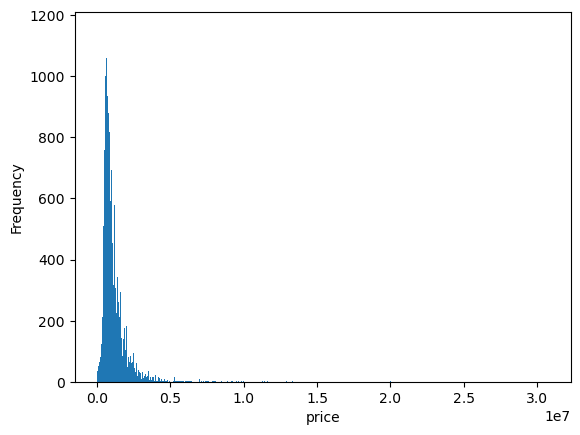
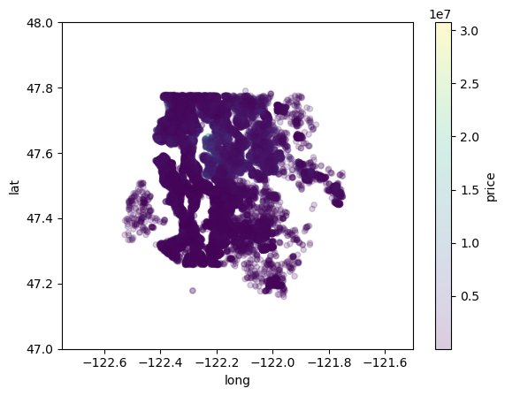
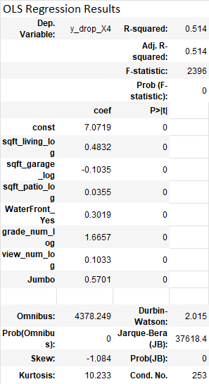
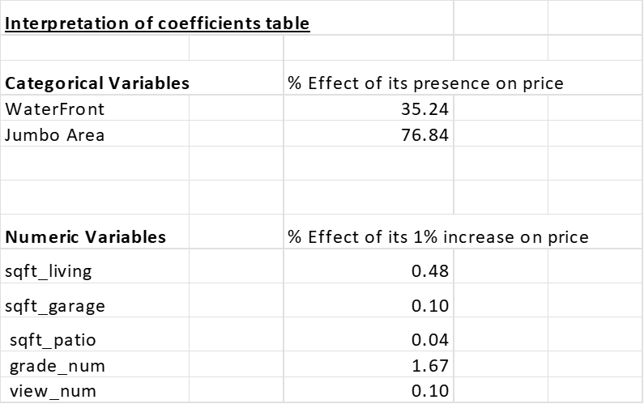

# **Housing Analysis Project**

# Business Understanding
The client is a housing planner that must set prices and wants to use market data to do so.  It is necessary to know the impact on the housing price of various real estate metrics, so that a price can be estimated. 

# Data Understanding
The data is housing data from a Northwestern county and comes from the county government.  Key data categories include price, number of rooms, various square footage metrics, and age of the house. Each row of data represents a different house soled. 

The distribution of the houses is such that nearly all observations are within the Greater Seattle Area while the rest are distributed over the entire U.S.

Prices have a non-normal, right skewed distribution, with potential outliers.  The median is 865,000. The mean is 1,113,290. 

 

There appear to be some patterns/dividing line in King County (non-outlier) map data, and an area near the center of the map with higher price houses.

        

# Data Modeling

#### Run baseline model based on most sign. correlated variable: sqft_living

- Baseline model is significant, variable coefficient is signficant and positive as expected.

#### Methodology/Other models

- **Second model**: Add to baseline, variables with price correlation greater than .25 and sqft_living correlation less than .75 to increase rsquared. 
-Big non-linearity issue, maybe heterskedaticity issue. Some heteroskedacity in predictor/residual plots. Non-normality in dep.     distribution and some also in indep. var. distributions.

- **Third Model**: Log price/sqft living variables based on non-linearity issues (in residual plots and part regress) and non- normal issues in histograms. 
-There still are non-linearity issues, and maybe heterskedaticity. Heteroskedaticity is improved in logged indep and logged dep. variables but persists in other independent variables (e.g. patio/gar).

- **Fourth Model**: More log tranformed variables (sqft_patio,sqft_garage) and 0 bedroom houses removed and remove bedrooms as predictor. Also create dummy var's for whether house has garage or patio. 
-The aim is to improve on linearity issue, heteroskedaticity issues, and non-normality issues and to improve rsquared.
       
-This model has similar issues of non-linearity, non-normality (Jarque-Beta test) heteroskedacities, although heteroskedacities are       improved. But 0 values in garage and patio variables are still problematic.

## Thus, in final model:

- Log all numerical variables from prior model (sqft_living_log, sqft_garage_log, sqft_patio_log, grade_num_log, view_num_log) due to non-normality(despite improvement) and some heteroskedaticity.
- Add categorical variables Waterfront and Jumbo to increase rsquared.
- Also drop outliers in sqft_gar and sqft_pat variables. (And drop associated dummy variables as 0 patio/no garage houses removed.)
        
- Final model heteroskedacities, linearity, and normality of residuals are improved from the baseline model.  Heteroskedaticity is      somewhat improved from prior model (particularly in residual plots against sqft_gar and sqft_pat variables).  Residual plot appears normally distributed, and is improved from previous model, however J-B test still failed suggesting non-normality. Multicollinearity is low, all correlations below .75.
         
# Results/Recommedations/Next Steps

-  **Rsq is 0.51** compared to baseline of  0.38 and previous model of 0.46. This means the model accounts for **51% of the variation** in the dependent variable.

- **The mean squared error of the model is about 0.41**.  This is the mean squared error in terms of log(Y). This is a measure of how far off the predictions of log(price) are from the actual log(price). Ideally, one would convert to terms of change in Y. 

- **0.64 is the root mean squared error in terms of log(Y)**. This is about the average of how far off the predictions of log(price) are from the actual log(price). Ideally, one would convert to terms of change in Y (but this may not be as simple as taking the exponent of the mse of log(Y)). 

- **All seven predictor variables are significant.**

### Recommendations

- To determine a price of a house, take a similar house with about 10% less sqft of living area and add 4.85% to that price.
- To determine a price of a house with a waterfront, take a similar house without a waterfront and add 39.68% to the non-waterfront price.
- To determine a price of a house in the Jumbo area, take a similar house not in the Jumbo area and add 76.84% to the non-Jumbo price.

### Next steps

- Establish a better interpretation of the root mean squared error.
- Further analyze the negative coefficient of garage size variable.
- Also testing interaction variables (e.g. differing lot sizes and house sizes for different geographic areas.)
    
# Repository Structure

- data
- images
- README.md
- Presentation_RealEstate.pdf
- Real_estate_notebook.ipynb