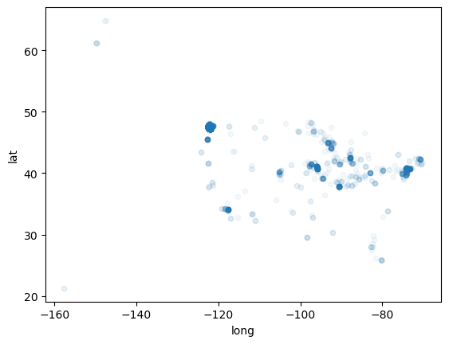

## Business Understanding
The client is a housing planner that must set prices and wants to use market data to do so.  It is necessary to know the impact on the housing price of various real estate metrics, so that a price can be estimated. 

## Data Understanding
The data is housing data from a Northwestern county and comes from the county government.  Key data categories include price, number of rooms, various square footage metrics, and age of the house. Each row of data represents a different house soled. The distribution of the houses is such that nearly all observations are within the Greater Seattle Area while the rest are distributed over the entire U.S.

## Data Modeling

#### Run baseline model based on most sign. correlated variable: sqft_living
Baseline model is significant, variable coeff. is signf. and positive as exp.

## Methodology/Other models

   #### Next model: Add to baseline, variables with price correlation greater than .25 and sqft_living correlation less than .75 to increase rsquared.
              big non-linearity issue, maybe heterskedaticity issue. Some heteroskedacity in predictor/residual plots. Non-normality in dep.               distribution and some also in indep. var. distributions.

   #### Start building log price/sqft living model based on non-linearity issues (in residual plots and part regress) and non- normal issues in histograms.
Modest improvement in 0-centeredness of residuals but still non-linear issues, maybe heterskedaticity, it is improved in logged indep and logged dep. variable but persists in other indep variables (inc. patio/gar)

   #### New model with more log tranformed variables (sqft_patio,sqft_garage, grade and view ) *Improving on linearity issue and heteroskedaticity issues and non-normality issues(despite improvements).
Also,0 bedroom houses removed b/c errors and remove bedrooms as predictor b/c insign. 
from previous model, no improvement in linearity or normalness of residuals. Also Rsquared not improved. some heteroskedacities improved 

   #### Thus start final model with latitude/longitude data 
Based on above, ~97% of houses in Greater Seattle area as opposed to rural Washington. (And of those 97%, they are clustered in 6 areas).
creating area categorical variable based on lat/long scatter plot
areas are  sign. corr to price , using matrix.

## Results
Four out of five numerical variables are significant: grade, sqft living, sqft patio, view (but not sqft garage). All four have positive relationship with price as expected. Most signficant are grade and sqft living. for each 1% increase in sqft_living we see an associated change of 0.49% in price. and for So for each 1% increase in grade_num we see an associated change of 1.19% in price.
    All area/categorical variables signficant. Northern areas, inclduing Seattle and Redmond are signicantly and materially higher in price than rural areas. Southern areas including Federal Way and Kent are signicantly and materially lower in price than rural areas. MidEast of greater Seattle, incl. Bellevue is signicantly and materially higher in price than rural areas, while MidWest of greater Seattle, incl. Burien/Seattle is signicantly and materially lower in price than rural areas.
    Assumptions of linear regresstion largely met based on lineairy, homoskedaticity, low multicolliniearity. Maybe normality issues based on Jarque-Bera score but resiudal plot looks fairly normal.
    Next steps could be to try to improve on rsquared/reduce small non-linearity: could test interaction variables (e.g. differing lot sizes and house sizes for different metropolitan and rural areas.
    
# Repository Structure

├── data
├── images
├── README.md
├── Presentation.pdf
└── notebook.ipynb    